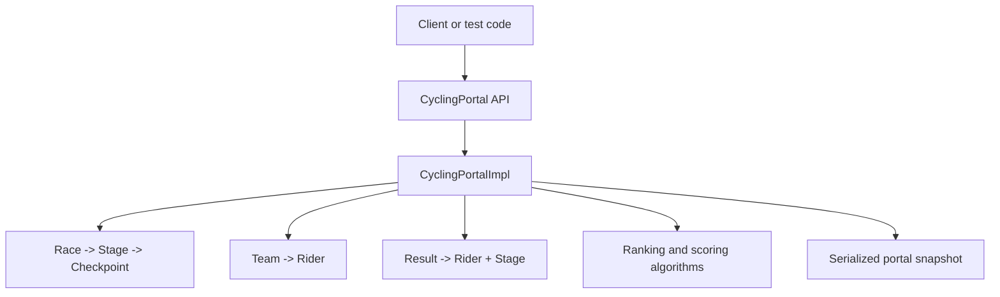

# Cycling Staged Race Management System

An in-memory Java 17 domain model and API for managing staged cycling races,
teams, riders, checkpoints and race results.

This repository is a portfolio-oriented refinement of a university programming
project. It demonstrates object-oriented modelling, collection-based data
management, validation, ranking and scoring algorithms, persistence, automated
testing and build automation. It is not presented as a production race
management platform.

## Features

- Create and remove races, stages, teams and riders
- Model flat, mountain and time-trial stages
- Add intermediate sprints and categorised climbs
- Enforce stage preparation and result-registration states
- Record ordered checkpoint and finish times
- Rank riders by elapsed and adjusted elapsed time
- Calculate stage finish, sprint and mountain points
- Aggregate general, points and mountain classifications across a race
- Cascade deletions to prevent orphaned stages, checkpoints and results
- Save and load complete portal snapshots using Java serialization
- Validate invalid names, identifiers, stage lengths, checkpoint locations,
  result counts and result chronology

## Architecture



`CyclingPortalImpl` owns the in-memory collections and coordinates lifecycle
operations. Domain objects maintain relationships such as race-to-stage and
team-to-rider, while the service performs cross-entity validation, cascading
deletion, classification and persistence.

The API remains synchronous and single-threaded. The implementation does not
claim thread safety or contain multithreading, database, web, GUI or deployment
functionality.

## Domain model

- `Race` contains an ordered collection of stages.
- `Stage` belongs to one race and contains checkpoints ordered by distance.
- `Checkpoint` represents an intermediate sprint or categorised climb.
- `Team` contains riders.
- `Rider` belongs to one team.
- `Result` links one rider to one stage and stores ordered timing data.

Identifiers are owned by each `CyclingPortalImpl` instance and are persisted
with the portal state. This avoids collisions after loading saved data.

## Ranking and scoring

Stage rankings use elapsed time, with rider ID as a deterministic tie-breaker.
For non-time-trial stages, consecutive riders separated by less than one second
receive the same adjusted elapsed time. This grouping is chained through a
finishing group.

Points are calculated from:

- Stage finish position, using the scale for the stage type
- Intermediate sprint position
- Categorised-climb position

Race-level general, points and mountain classifications aggregate the
corresponding stage values.

## Requirements

- Java Development Kit 17 or later
- Apache Maven 3.9 or later

## Build and test

Run the complete clean build and automated test suite:

```bash
mvn clean test
```

Build the distributable JAR:

```bash
mvn clean package
```

The same clean verification runs in GitHub Actions for pushes and pull
requests.

## Test coverage

The JUnit 5 suite covers:

- Race and stage creation, validation and cascading deletion
- Team and rider management
- Checkpoint ordering and stage-state restrictions
- Result count, ordering and duplicate validation
- Equal-time rankings and adjusted elapsed times
- Finish, sprint and mountain points
- Multi-stage race classifications
- Invalid identifier handling
- Save/load round trips, ID continuity and failed-load atomicity

## Example

```java
CyclingPortal portal = new CyclingPortalImpl();

int raceId = portal.createRace("Tour", "Example staged race");
int stageId = portal.addStageToRace(
        raceId,
        "Opening",
        "Opening road stage",
        120.0,
        LocalDateTime.of(2026, 7, 1, 9, 0),
        StageType.FLAT);

int teamId = portal.createTeam("Velocity", "Example team");
int riderId = portal.createRider(teamId, "Alex Rider", 2000);

portal.concludeStagePreparation(stageId);
portal.registerRiderResultsInStage(
        stageId,
        riderId,
        LocalTime.of(9, 0),
        LocalTime.of(12, 15));
```

## Repository structure

```text
.
├── .github/workflows/ci.yml
├── src/main/java/cycling/
│   ├── CyclingPortal.java
│   ├── MiniCyclingPortal.java
│   ├── CyclingPortalImpl.java
│   └── domain types, enums and exceptions
├── src/test/java/cycling/CyclingPortalImplTest.java
├── .gitignore
├── LICENSE
├── NOTICE
├── pom.xml
└── README.md
```

Generated `.class`, `.jar`, serialization and Maven output files are excluded
from version control.

## Project origin and attribution

The public portal interfaces, enums and exception contracts originated from a
University of Exeter coursework scaffold and retain their original attribution
in source comments. The implementation, domain refactoring, automated tests,
build configuration and portfolio documentation are maintained in this
repository.

Before reusing coursework scaffold material, verify the applicable university
publication and assessment policies.

## Limitations

- In-memory storage only; no database or cross-process persistence
- Java serialization is suitable for demonstration, not long-term schema
  evolution or untrusted input
- No authentication, user interface, web API or deployment configuration
- No concurrency guarantees; a portal instance should be accessed from one
  thread unless external synchronization is provided
- Classification tie-breaking is deterministic but intentionally simpler than
  the complete professional cycling rulebook

## Future improvements

- Extract ranking and scoring into dedicated domain services if the feature set
  grows further
- Replace Java serialization with a versioned, portable persistence format
- Add coverage and static-analysis reporting to CI
- Introduce immutable value objects for timing and classification results

These are intentionally outside the current scope; the repository remains a
focused Java domain-modelling project.

## Licence

Repository-authored code is available under the [MIT License](LICENSE).
Supplied coursework API material is identified in [NOTICE](NOTICE) and retains
its original attribution; confirm its applicable reuse terms before
redistributing that scaffold independently.
